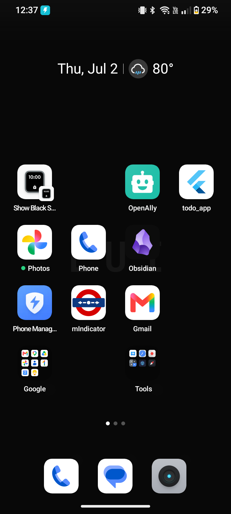

<div align="center">
  
  <h1>📋 Todo App</h1>
  <p><strong>A full-featured cross-platform Todo application built with Flutter & Electron</strong></p>
  <p>
    
    
    
    
    
    
    
  </p>
</div>

---

## ✨ Features

### 📝 Task Management
| Feature | Flutter | Electron |
|---------|:-------:|:--------:|
| Create / Edit / Delete todos | ✅ | ✅ |
| Due dates with date picker | ✅ | ✅ |
| Priority levels (High / Medium / Low) | ✅ | ✅ |
| Rich text descriptions | ✅ | ✅ |
| Tags for organization | ✅ | ✅ |
| Categories with custom colors | ✅ | ❌ (uses tags) |
| Subtasks with progress tracking | ✅ | ✅ |
| Drag & drop reordering | ✅ | ✅ |
| Pin to top | ❌ | ✅ |

### 🔄 Recurring Tasks
- **Daily** — repeats every N days
- **Weekly** — repeats on selected days of the week
- **Monthly** — repeats on a specific day of the month
- **Yearly** — repeats on the same date each year
- **Custom interval** — flexible recurrence with optional end date

### ⏰ Reminders & Notifications
- Per-task reminder with custom date/time
- Local push notifications via `flutter_local_notifications`
- Due date checking on app startup
- Desktop notifications (Electron)

### 🍅 Pomodoro Timer
- **Work sessions** (25 min default)
- **Short breaks** (5 min)
- **Long breaks** (15 min, after 4 sessions)
- Session counter
- Auto-cycles through work → break loops
- Persistent timer state across app restarts

### 📅 Calendar View
- Monthly calendar via `table_calendar`
- Color-coded dots for tasks with due dates
- Tap a date to see that day's tasks
- Navigate between months
- Jump to today

### 📊 Statistics & Charts
- **Completion rate** over the last 7 days (bar chart)
- **Priority distribution** (pie chart)
- **Current streak** — consecutive days with completed tasks
- **Total completions** — lifetime count
- Built with `fl_chart`

### 🎨 Customization
- **Dark / Light / System** theme modes
- **12 accent colors** to personalize the UI
- Material Design 3 (Material You)
- Smooth staggered list animations
- Grid and list view toggle

### 💾 Backup & Restore
- **JSON export** — full backup of all todos, categories, subtasks
- **CSV export** — spreadsheets-compatible task export
- **Import** JSON backup files
- **Share** backups via system share sheet (`share_plus`)
- Auto-generated filenames with date stamps

### 🔍 Filtering & Sorting
- **Search** by title
- **Filter** by: All, Today, Priority, Category, Tags, Done/Pending
- **Sort** by: Due date, Priority, Title, Created date, Custom (drag order)
- Multi-select for batch operations

### 📱 Additional
- Android home screen widget (`home_widget`)
- Voice input button (placeholder)
- Image attachment support (`image_picker`)

---

## 🖼️ Screenshots

| Home Screen | Add Todo | Calendar | Stats |
|:-----------:|:--------:|:--------:|:-----:|
|  | — | — | — |

*(Add your screenshots to the `screenshots/` directory and update the table)*

---

## 🏗️ Architecture

### Flutter App (Android / Windows)

```
main.dart
  └── TodoApp (MultiProvider)
        ├── TodoProvider      → CRUD, filters, subtasks, stats
        ├── ThemeProvider     → Dark/light mode, accent color
        └── PomodoroProvider  → Timer state & sessions
              └── MaterialApp (themed)
                    ├── HomeScreen (list/grid)
                    ├── AddEditTodoScreen
                    ├── CalendarScreen
                    ├── StatsScreen
                    ├── CategoriesScreen
                    ├── PomodoroScreen
                    ├── SettingsScreen
                    └── BackupScreen
```

### Electron App (Windows Desktop)

```
main.js (Main process)
  └── BrowserWindow
        ├── IPC handlers (CRUD, file I/O)
        ├── Due date checker (periodic)
        └── Recurring task processor
              └── preload.js (context bridge)
                    └── index.html / app.js / styles.css
                          └── Vanilla JS SPA
                                ├── CRUD, calendar, pomodoro
                                ├── Drag & drop, tags, search
                                └── Desktop notifications
```

### Data Flow

```
UI (Screens / Widgets)
    ↕  watch() / read() via Provider
Providers (ChangeNotifier)
    ↕
Repositories (TodoRepository, CategoryRepository)
    ↕
DatabaseHelper (SQLite singleton)
    ↕
todos.db (SQLite database)
```

---

## 🗄️ Database Schema

### `todos` table
| Column | Type | Description |
|--------|------|-------------|
| `id` | INTEGER PK | Auto-increment |
| `title` | TEXT | Task title |
| `description` | TEXT | Rich text description |
| `priority` | TEXT | high / medium / low |
| `dueDate` | INTEGER | Epoch ms |
| `categoryId` | INTEGER FK | References categories |
| `isDone` | INTEGER | 0 or 1 |
| `tags` | TEXT | Comma-separated |
| `attachments` | TEXT | Comma-separated paths |
| `createdAt` | INTEGER | Epoch ms |
| `updatedAt` | INTEGER | Epoch ms |
| `recurringConfig` | INTEGER | 0=none, 1=daily, 2=weekly, 3=monthly, 4=yearly |
| `recurringInterval` | INTEGER | Every N days/weeks/months |
| `recurringDaysOfWeek` | TEXT | Comma-separated (0=Sun..6=Sat) |
| `recurringDayOfMonth` | INTEGER | 1-31 |
| `recurringEndDate` | INTEGER | Epoch ms |
| `recurringHasEnd` | INTEGER | 0 or 1 |
| `nextDueDate` | INTEGER | Epoch ms |
| `reminderAt` | INTEGER | Epoch ms |
| `hasReminder` | INTEGER | 0 or 1 |
| `sortOrder` | INTEGER | Drag-drop order |

### `categories` table
| Column | Type | Description |
|--------|------|-------------|
| `id` | INTEGER PK | Auto-increment |
| `name` | TEXT | Category name |
| `color` | TEXT | Hex color |
| `customColors` | TEXT | JSON array of hex colors |

### `subtasks` table
| Column | Type | Description |
|--------|------|-------------|
| `id` | TEXT PK | UUID |
| `title` | TEXT | Subtask text |
| `isDone` | INTEGER | 0 or 1 |
| `todoId` | INTEGER FK | References todos |
| `sortOrder` | INTEGER | Display order |

### `pomodoro_sessions` table
| Column | Type | Description |
|--------|------|-------------|
| `id` | INTEGER PK | Auto-increment |
| `todoId` | INTEGER FK | Associated task |
| `startedAt` | INTEGER | Epoch ms |
| `durationMinutes` | INTEGER | Session length |
| `completed` | INTEGER | 0 or 1 |

---

## 🚀 Getting Started

### Prerequisites

| Dependency | Version | Download |
|------------|---------|----------|
| Flutter | 3.44+ | [flutter.dev](https://flutter.dev) |
| Dart | 3.12+ | (bundled with Flutter) |
| Node.js | 18+ | [nodejs.org](https://nodejs.org) |

### Flutter App (Android)

```bash
# Clone the repo
git clone https://github.com/jiteshoffice1234-star/TodoApp.git
cd TodoApp

# Get dependencies
flutter pub get

# Run on Android device / emulator
flutter run

# Build APK
flutter build apk --release

# Build App Bundle
flutter build appbundle --release
```

### Flutter App (Windows)

```bash
# Enable Windows support
flutter config --enable-windows-desktop

# Run
flutter run -d windows

# Build installer
flutter build windows
```

### Electron App (Windows Desktop)

```bash
# Install Node dependencies
npm install

# Run in development
npm start

# Build installer
npm run build

# Build portable .exe
npm run build:portable

# Build MSI
npm run build:msi
```

### ⌨️ Android Studio / VS Code

1. Open the `TodoApp` folder
2. Run `flutter pub get`
3. Select a device/emulator
4. Press **Run** (▶️)

---

## 🧪 Running Tests

```bash
# Run all tests
flutter test

# Run with coverage
flutter test --coverage
```

> ⚠️ **Note:** Current test coverage is limited to model serialization tests. The widget test in `test/widget_test.dart` references an old `MyApp` class and will fail — it needs to be updated.

---

## 🧰 Tech Stack

### Flutter App
| Package | Version | Purpose |
|---------|:-------:|---------|
| `provider` | 6.1.2 | State management |
| `sqflite` | 2.3.2 | SQLite database |
| `intl` | 0.20.0 | Date formatting |
| `shared_preferences` | 2.2.3 | Settings persistence |
| `table_calendar` | 3.2.0 | Calendar view |
| `fl_chart` | 0.66.0 | Statistics charts |
| `reorderables` | 0.6.0 | Drag & drop |
| `flutter_local_notifications` | 18.0.1 | Push notifications |
| `csv` | 5.1.0 | CSV export |
| `share_plus` | 13.2.0 | File sharing |
| `image_picker` | 1.1.2 | Photo attachments |
| `home_widget` | 0.9.3 | Home screen widget |
| `flutter_staggered_animations` | 1.1.1 | List animations |
| `uuid` | 4.5.1 | Subtask IDs |
| `timezone` | 0.10.0 | Timezone support |

### Electron App
| Package | Version | Purpose |
|---------|:-------:|---------|
| `electron` | 33.4.11 | Desktop shell |
| `electron-builder` | 25.1.8 | Windows installer |

---

## 📁 Project Structure

```
TodoApp/
├── lib/                          # Flutter / Dart source
│   ├── main.dart                 # Entry point
│   ├── app.dart                  # Root widget (MultiProvider + MaterialApp)
│   ├── core/
│   │   ├── database/
│   │   │   └── database_helper.dart   # SQLite connection & migrations
│   │   ├── services/
│   │   │   ├── backup_service.dart    # JSON / CSV export/import
│   │   │   ├── notification_service.dart # Local notifications
│   │   │   └── widget_service.dart    # Home screen widget
│   │   └── theme/
│   │       └── app_theme.dart         # Light/dark themes, accent colors
│   ├── data/
│   │   ├── models/
│   │   │   ├── todo.dart             # Todo model + serialization
│   │   │   ├── subtask.dart          # Subtask model
│   │   │   ├── recurring_config.dart # Recurrence configuration
│   │   │   └── category.dart         # Category model
│   │   └── repositories/
│   │       ├── todo_repository.dart  # Todo data access
│   │       └── category_repository.dart # Category data access
│   ├── providers/
│   │   ├── todo_provider.dart        # Todo CRUD, filters, stats
│   │   ├── theme_provider.dart       # Theme & accent color
│   │   └── pomodoro_provider.dart    # Pomodoro timer
│   └── ui/
│       ├── screens/
│       │   ├── home_screen.dart      # Main todo list
│       │   ├── add_edit_todo_screen.dart # Create/edit form
│       │   ├── calendar_screen.dart  # Calendar view
│       │   ├── stats_screen.dart     # Statistics
│       │   ├── categories_screen.dart # Category manager
│       │   ├── pomodoro_screen.dart  # Timer UI
│       │   ├── settings_screen.dart  # Appearance settings
│       │   └── backup_screen.dart    # Backup & restore
│       └── widgets/
│           ├── todo_card.dart        # List tile
│           ├── grid_todo_card.dart   # Grid tile
│           ├── priority_badge.dart   # Priority indicator
│           ├── empty_state.dart      # Empty placeholder
│           └── voice_input_button.dart # Voice input stub
├── src/                          # Electron / web frontend
│   ├── index.html                # Main HTML page
│   ├── app.js                    # Full Electron SPA (CRUD, calendar, pomodoro)
│   └── styles.css                # Complete stylesheet
├── main.js                       # Electron main process
├── preload.js                    # Electron context bridge
├── package.json                  # Node / Electron config
├── pubspec.yaml                  # Flutter / Dart config
├── test/
│   ├── models_test.dart          # Model unit tests
│   └── widget_test.dart          # Widget test (⚠️ outdated)
├── android/                      # Android platform
├── windows/                      # Windows platform
└── README.md
```

---

## 🔐 Known Issues & Limitations

> See the full audit in [AUDIT.md](AUDIT.md) (or refer to [GitHub Issues](https://github.com/jiteshoffice1234-star/TodoApp/issues))

| Issue | Severity | Details |
|-------|:--------:|---------|
| Drag-drop reorder broken | 🔴 High | `_filteredTodos.removeAt()` operates on a new list — reorder does nothing |
| Pomodoro infinite loop | 🔴 High | Work → break cycle has no stop/quit button |
| Widget test failing | 🟡 Medium | References old `MyApp` counter widget |
| Notifications never init | 🟡 Medium | `_initNativeServices()` is empty |
| No database indexes | 🟡 Medium | Frequent query columns unindexed |
| No pagination | 🟢 Low | All todos loaded into memory at once |
| Duplicate color parsers | 🟢 Low | `_hexToColor` duplicated across 5+ files |
| No encryption | 🟢 Low | Plain SQLite / JSON storage |

---

## 🤝 Contributing

1. Fork the repository
2. Create a feature branch: `git checkout -b feature/my-feature`
3. Commit your changes: `git commit -m "Add my feature"`
4. Push to the branch: `git push origin feature/my-feature`
5. Open a Pull Request

---

## 📄 License

This project is licensed under the **MIT License** — see the [LICENSE](LICENSE) file for details.

---

<div align="center">
  <sub>Built with ❤️ using Flutter, Dart, and Electron</sub>
  <br>
  <a href="https://github.com/jiteshoffice1234-star/TodoApp">GitHub</a> •
  <a href="https://github.com/jiteshoffice1234-star/TodoApp/issues">Issues</a> •
  <a href="https://github.com/jiteshoffice1234-star/TodoApp/pulls">Pull Requests</a>
</div>
